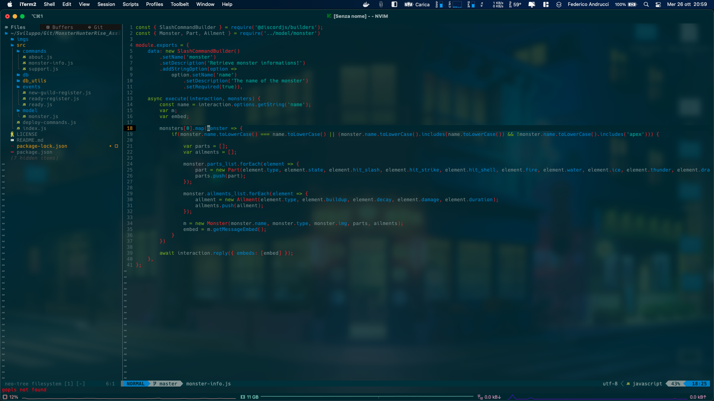

<h1 align="center">My Nvim Configuration</h1>

    
    
    
    
  

This setup works perfectly on my macOS and has been tested on my Ubuntu.

## About this configuration
---

### General
- [Packer]() as package manager
- [nvim-toggleterm]() for the terminal integration
- [nvim-notify]() for nice notifications
- [alpha.nvim]() for a fully customizable dashboard
- [Neosolarized]() as main colorscheme

### Coding
- [nvim-lspconfig]() built-in LSP configuration
- [treesitter]() for syntax
- [nvim-cmp]() for the auto completion
- [null-ls]() for auto formatting
- [Luasnip]() for all the snippets
- [go.nvim]() for golang development
- [neogit]() for git integration
- [symbols-outline]()

### Navigation
- [neo-tree]() as a file tree navigator
- [telescope.nvim]() for every kind of search
- [bufferline.nvim]() for a bufferline with tabpage integration

## Installation
For the installation you can use the [install.sh](install.sh). Now it works on debian/ubuntu and macos systems. Or simply you can install nvim manually and copy all the configurations in your nvim folder.

USE AT YOUR OWN RISK!
